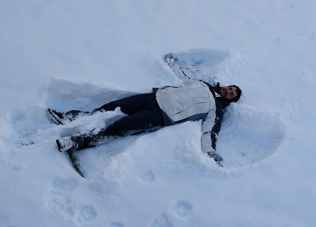
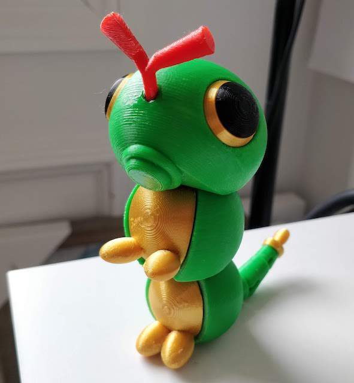
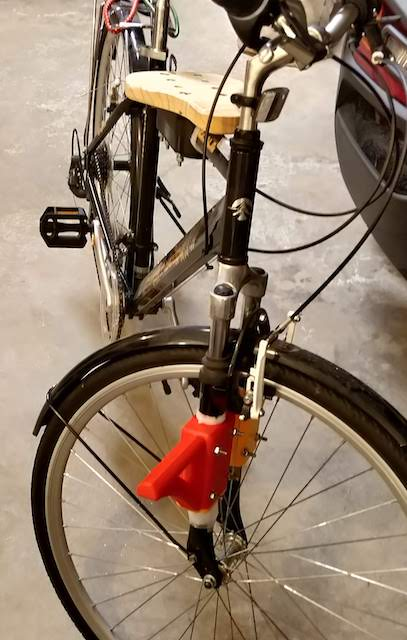
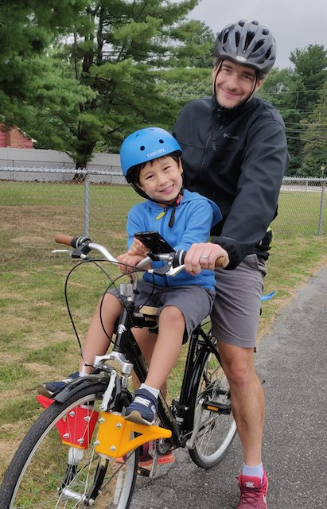
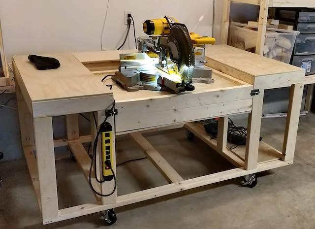
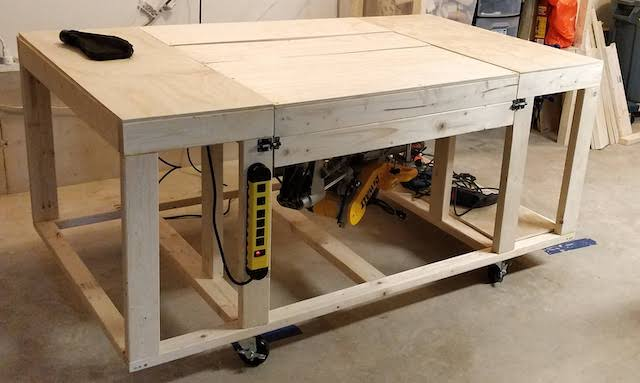
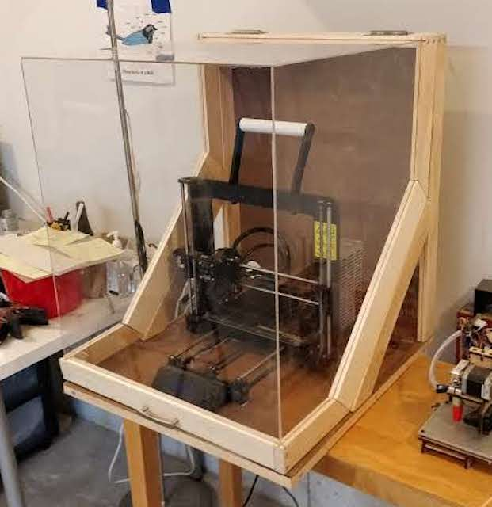

I'm a self-taught developer with experience in many languages and frameworks.
My specialty is to _distill_ knowledge: learn complicated things and then apply them on my work.

I also like to teach the things I learn to get the most diverse perspectives about the topics.

Building things is my hobby, including software.
Many times when I'm not programming for work, I'm programming on my personal projects.
But I also like to build things with wood and print things with my 3D printer.

Here are some of the things I've designed, printed and built:

#### Caterpie

From Pokemon:

#### Bike Seat

This past summer (2020) I got to spend a lot of time with my son and I built this seat to carry him and catch Pokemon around town.
It is a combination of wood and 3D printed parts.

My son loves it!

#### Workbench

Back in April 2020 I bought a mitter saw, a big one.
Since I needed a workbench, I decide to build one that could hide the mitter saw when not in use.
The center part of the table spins to hide the saw underneath it.

#### 3D Printer Box

Since I keep my 3D printer in my garage, during winter it gets too cold to print.
So I decided to build a box to protect it.
It works like a charm!

